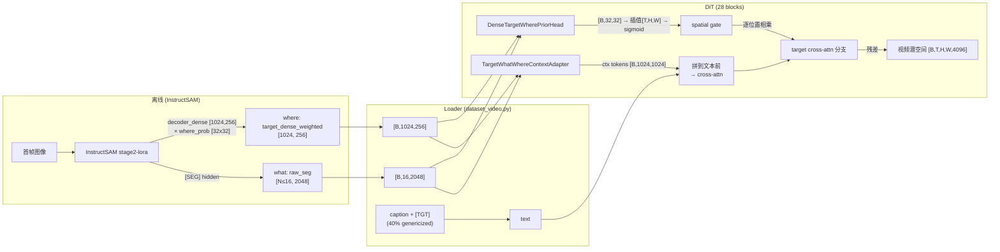

# what-where-softlogit：判别性 VLM 特征引导 Cosmos 视频生成

> 让 InstructSAM(VLM) 的目标特征**真正引导** Cosmos-Predict2.5 视频生成"操作哪个 / 哪里的物体"，
> 与文本**互补**（非 text-free），解决纯文本无法消歧的场景。
>
> - Git 分支：`what-where-softlogit`（origin: `JJho1314/VLM4WAM`）
> - 实验名：`predict2_video2world_training_2b_droid_success_v21_what_where_softlogit`
> - 基座：Cosmos-Predict2.5-2B video2world（rectified flow），`MiniTrainDIT`，28 blocks，`model_channels=4096`，`crossattn_emb_channels=1024`

---

## 目录
1. [动机与根因](#1-动机与根因)
2. [整体架构](#2-整体架构)
3. [特征制备（离线，InstructSAM）](#3-特征制备离线instructsam)
4. [数据加载（Loader）](#4-数据加载loader)
5. [网络架构（核心）](#5-网络架构核心)
6. [训练目标](#6-训练目标)
7. [推理](#7-推理)
8. [维度流水线速查](#8-维度流水线速查)
9. [配置与代码索引](#9-配置与代码索引)
10. [验证结论与 TODO](#10-验证结论与-todo)
11. [HPC3 资产](#11-hpc3-资产)

---

## 1. 动机与根因

**问题**：早先的 `what_where_prior_context` 版本里，VLM 特征经 adapter 后对视频生成**几乎没有引导作用**。

**根因（2026-06-22 验证）**：作为"where（在哪里）"条件的 `decoder_dense` 特征是**对文本 query 不敏感**的——
InstructSAM 在 `instructsam_mask.py` 把 decoder-dense 在**所有 object query 上求平均**（`dense.mean(dim=0)`）。
结果 carrot 与 banana 的 dense 特征 **cosine 0.994**（几乎相同），换文本 query 几乎不改变 dense，且改变不落在目标上。

**判别信号在哪**：真正区分目标的是 **`[SEG]·dense` 匹配**（InstructSAM 的 mask 步骤，即 pre-sigmoid mask logits）。
同一帧用 carrot vs banana query，选中 slot 的软 mask-logit 图空间相关性仅 **0.026**、峰值在不同位置、IoU 0。
"what（是什么）"的 raw_seg `[SEG]` 也是判别的（cosine 0.91）。

**解决思路**：
1. 把"where"从不可分的**平均 dense** 换成判别的 **`[SEG]·dense` 软定位**（加权 dense）。
2. 训练上**逼模型用特征**：caption dropout 把物体名抹掉、只留 `[TGT]` 占位。
3. 加 conditioning dropout 以支持 CFG。
4. 修复**失效的注意力对齐损失**（旧的 min-max MSE 在 28 个 block 上退化成均匀注意力）。

---

## 2. 整体架构

InstructSAM 产出两类特征 → Loader 取出 → DiT 内**两条并行路径**注入：
① 作为 cross-attention 的 context token（"给什么语义 / 是哪个"）；
② 解出一张空间门 spatial gate（"在哪里"），逐 block 调制 target 分支。文本流始终保留，二者互补。



---

## 3. 特征制备（离线，InstructSAM）

每个 episode 用目标 query（caption 中 `[TGT]` 后的短语）跑 InstructSAM，产出：

| 特征 | 目录 | 维度 / 内容 |
|---|---|---|
| **what（身份）** | `target_features_rawseg_ft` | `[SEG]` 隐状态 `[N≤16, 2048]` |
| **where（定位）** | `target_features_where_softlogit_stage2_lora` | `target_dense_weighted [1024,256]` fp16；另存 `where_prob[32,32]`、`where_logit[32,32]`、`target_proto[256]` |

**where 的计算**（`tools/precompute_where_softlogit.py`，HPC3）：
1. 跑 InstructSAM 得 `pred_masks`（每个 object slot 的软 logit，形状 `(1, N_obj=10, 288, 288)`）。
2. 按 `cls_score` argmax 选中目标 slot → 取其软 mask-logit → resize 到 `32×32` → `where_logit` / `where_prob = sigmoid(where_logit)`。
3. 取 `decoder_dense` 网格 `[1, 1024, 256]`（32×32 token × 256-d）。
4. **`target_dense_weighted = decoder_dense_grid × where_prob`（逐格加权）→ `[1024, 256]`**——既判别又带语义的目标专属 dense。
5. `target_proto = where-pooled(decoder_dense)` → `[256]`（备用）。
   query 从已有的 dense .pt 读取，保证与 "what" 对齐。

> `1024 = 32×32` 空间格；`256` 是 InstructSAM decoder 通道数。
> Cosmos 实际只消费 `target_dense_weighted`（其余键用于诊断/可视化）。

---

## 4. 数据加载（Loader）

`dataset_video.py`（注意：该文件位于 `…/datasets/local_datasets/`，在主仓库被 `.gitignore` 的 `datasets/` 规则误伤，
分支内用 `git add -f` 强制纳入）。

| 项 | 值 / 行为 |
|---|---|
| `target_feature_dir` | `target_features_rawseg_ft`，`target_feature_dim=2048`，`target_feature_max_tokens=16` → **`[16, 2048]`**（截断/补零） |
| `target_dense_feature_dir` | `target_features_where_softlogit_stage2_lora`，`target_dense_feature_dim=256`，`target_dense_feature_max_tokens=1024` → **`[1024, 256]`** |
| 特征选键 | `_select_feature_from_mapping` 的键列表含 `target_dense_weighted`，故新特征走既有 dense 通路，无需改 net 装载 |
| `caption_dropout_prob=0.4` | 40% 概率把 caption 换成 `generic_caption`（保留 `[TGT]`、去掉物体名）→ 逼模型从**特征**读身份 |
| `target_mask_dropout_prob=0.1` | 10% 同时清零 mask+特征 → CFG null |
| `tgt_token_text` | **永远设置**（`"[TGT]"` 或 `""`）→ 修复 drop_mask 路径下 collate 的 `KeyError` |
| 时序 | `frame_stride ∈ {1,2,3}`，49 帧，320×576 |

---

## 5. 网络架构（核心）

DiT 接收：视频潜空间 `x [B,T,H,W,4096]`、文本 cross-attn 上下文 `crossattn_emb [B,L_text,1024]`、
以及 `target_feature [B,16,2048]` 与 `target_dense_feature [B,1024,256]`。

两路注入在 `MinimalV1LVGDiT.forward` 内构建，逐 block 在 `Block.forward` 内施加。

### 5.1 路径①：context tokens —— `TargetWhatWhereContextAdapter`

`minimal_v4_dit.py::TargetWhatWhereContextAdapter`（实例化时 `out_dim = crossattn_emb_channels = 1024`，`max_tokens=1024`，`hidden_dim=512`）。

```
what  [B,16,2048] ─LN─ MLP(2048→512→1024) ─ valid-masked mean(16 tokens) ─► what_ctx  [B, 1024]       (单个身份向量)
where [B,1024,256]─LN─ MLP(256 →512→1024) ─────────────────────────────► where_ctx [B,1024,1024]    (每空间格 1 个 token)
coords[B,1024,2]  ─ Linear(2→1024) ────────────────────────────────────► coord_ctx [B,1024,1024]    (正则化网格坐标嵌入)

gate   = sigmoid(where_gate(what_ctx))                         [B, 1, 1024]   (what 调制 where, where_gate 零初始化)
tokens = where_ctx * gate + what_ctx(broadcast) + coord_ctx                 [B,1024,1024]
tokens = out_norm(tokens) + type_token
tokens = tokens * tanh(context_gate)   (无效位置置零)          ─►  context tokens [B, 1024, 1024]
```

要点：
- `what` 在 16 个 token 上做 **valid-masked 平均**，压成单个身份向量后广播到每个空间 token。
- `where_gate` / `type_token` **零初始化**，`context_gate` 用 `tanh` 控制注入强度——初期近似恒等，训练中逐步开启，稳定收敛。
- 输出 1024 个 context token（与文本 token 同维 1024），通过 `append_target_feature_context` **拼到文本 token 之前**：
  `crossattn_emb ← cat([feature_tokens, crossattn_emb], dim=1)`（`target_feature_context_replace_text=False`，即**保留文本**，互补不替换）。
- 这 1024 个 token 既进**主 cross-attn**，也作为**专用 target 分支**的 K/V（`make_target_branch_attention_token_indices`）。

### 5.2 路径②：spatial gate —— `DenseTargetWherePriorHead`

`minimal_v4_dit.py::DenseTargetWherePriorHead`（`hidden_dim=128`，`init_bias=-2.0`）。
该 head 只产**内部隐空间 prior**，推理时 Cosmos 不接收任何显式 mask——prior 由特征预测得到。

```
what [B,16,2048] ─LN─ MLP(2048→128→128) ─ mean ─┐
                                                  ├─ FiLM(γ,β) 调制
where[B,1024,256]─LN─ Linear(256→128) ──reshape 32×32──┘
   + coord(2→128)  →  in_proj(1×1) → [dw3×3→pw1×1]×2 (深度可分卷积) → logit_head(1×1)
   ─►  prior_logits [B, 32, 32]
```

`forward` 内（`minimal_v4_dit.py` ~L3400）：
```
prior_logits [B,32,32]
  → trilinear 插值到潜空间 (T,H,W)              prior_logits [B,T,H,W]
  → 无效样本位置填 -20                          (CFG null / 无特征时关闭门)
  → sigmoid                                     target_spatial_gate [B,T,H,W]
```

### 5.3 Block 内注入（每个 block，共 28 层）

`minimal_v4_dit.py::Block.forward`（~L2515）：
```
target_result [B,T,H,W,4096] = CrossAttn(x_query, context=feature_tokens)        # target 分支
if spatial_gate is not None:
    target_result *= spatial_gate[..., None]          # 只在目标位置保留 ("where")
x = x + target_cross_attn_gate * target_result        # 残差注入回 4096-d 潜空间
```
同时主 cross-attn 对拼好的 `[feature tokens ; 文本]` 上下文做注意力（"what / 语义"）。

> 直觉：路径① 决定"注入什么语义"，路径② 决定"注入到画面的哪个位置"，两者相乘后残差加进视频潜空间。

---

## 6. 训练目标

总损失 = 主扩散损失 + where-prior 损失 + 注意力对齐损失。

| 损失 | 说明 |
|---|---|
| **Rectified-flow 主损失** | Cosmos video2world 标准速度场回归 |
| **where-prior 损失** | 用 GT mask 监督 `DenseTargetWherePriorHead`：pos/neg BCE + Dice（指标 `target_where_prior_*`），让 `[32,32]` 门学会对准目标 |
| **注意力对齐损失** | **本方案修复点**。旧版用 per-sample min-max 归一 + pos/neg MSE（scale-free，退化为均匀注意力，权重 0.005 形同无效）。新版：<br/>`supervised_attn = attn · token_valid`；`attn_dist = supervised_attn / (Σ + eps)`；`target_mass = Σ(attn_dist · pos_weight)`；**`loss = -log(target_mass)`**。即直接最大化"落在目标区域内的注意力质量"。权重 `target_attention_loss_weight=0.05` |

其它训练设置：
- `caption_dropout_prob=0.4`、`target_mask_dropout_prob=0.1`（见 §4）
- **从 base 重训 3000 iter**（非 fine-tune），分辨率 320×576、49 帧、`bs4×accum4`、`gbs128`

代码：`video2world_model_rectified_flow.py`（注意力对齐损失，~L232–260）。

---

## 7. 推理

`inference.py::_get_target_condition` 装载 `target_feature` 与 `target_dense_feature`（认 `target_dense_weighted` 键）。
`config.py` 新增开关：
- `instructsam_feature_mode ∈ {mask_query, raw_seg, decoder_dense}`
- `route_decoder_dense_to_target_dense_feature`：把 decoder_dense 路由到 `target_dense_feature`、raw_seg 路由到 `target_feature`
- `pass_instructsam_mask_to_cosmos=False`：mask-free 推理（Cosmos 不接收显式 mask）

CFG：用 `target_mask_dropout` 训练出的 null 分支做 classifier-free guidance。
评测脚本 `scripts/generate_tavid_mask_samples.py` 支持 `--target-feature-mode {keep,zero,drop,swap}` 做特征消融。

---

## 8. 维度流水线速查

| 阶段 | what 路 | where 路 |
|---|---|---|
| InstructSAM .pt | `[SEG] [N≤16, 2048]` | `target_dense_weighted [1024, 256]` |
| Loader（batch） | `[B, 16, 2048]` | `[B, 1024, 256]` |
| ContextAdapter | → 身份 `[B, 1024]`（广播） | → `[B, 1024, 1024]` |
| 融合 context tokens | `[B, 1024(token), 1024(dim)]`（拼到文本前）→ 进 28-block cross-attn | |
| PriorHead | 同输入 → `prior_logits [B, 32, 32]` | |
| → spatial gate | 插值 `[B, T, H, W]` → sigmoid | |
| Block 注入 | `target_result [B,T,H,W,4096] × gate[...,None]` → 残差加入 `x [B,T,H,W,4096]` | |

**一句话**：`[SEG]2048 →身份1024` ＋ `加权dense[1024,256] →空间ctx[1024×1024]` ⟹ 1024 个 1024-d context token（拼文本前进 cross-attn）；
**同一对特征**再过 prior head 出 `[32,32] →插值[T,H,W]→sigmoid 门`，逐 block 把 target 分支按位置乘进 4096-d 视频潜空间。

---

## 9. 配置与代码索引

| 文件 | 关键符号 |
|---|---|
| `cosmos_predict2/experiments/base/robointer.py` | `predict2_video2world_training_2b_droid_success_v21_what_where_softlogit`（deepcopy 自 `..._what_where_prior_context`）；`_WHERE_SOFTLOGIT_DIR`；net 开关 `target_what_where_context_tokens / _spatial_prior / _where_dim=256 / _hidden_dim=512 / _max_tokens=1024 / _prior_hidden_dim=128 / _prior_init_bias=-2.0`；`target_attention_loss_weight=0.05` |
| `…/networks/minimal_v4_dit.py` | `TargetWhatWhereContextAdapter`、`DenseTargetWherePriorHead`、`append_target_feature_context`、`compute_target_attention_map`、`Block.forward`（spatial gate 施加） |
| `…/models/video2world_model_rectified_flow.py` | 注意力对齐损失 `-log(mass_inside)` |
| `…/datasets/local_datasets/dataset_video.py` | `_select_feature_from_mapping`（含 `target_dense_weighted`）、`caption_dropout_prob` / `generic_caption`、`tgt_token_text` |
| `cosmos_predict2/config.py` | `instructsam_feature_mode`、`route_decoder_dense_to_target_dense_feature`、`pass_instructsam_mask_to_cosmos` |
| `cosmos_predict2/inference.py` | `_get_target_condition` |
| `…/callbacks/{iter_speed,wandb_log}.py` | `target_where_prior_*` 指标 |
| `scripts/generate_tavid_mask_samples.py` | 评测/特征消融 |
| `tools/precompute_where_softlogit.py`（HPC3） | 生成 `target_dense_weighted` |

---

## 10. 验证结论与 TODO

**结论（2026-06-24，已验证）**：新模型确实**用上了** VLM 特征引导生成。
- `where_prior` 内/外比 4–6（旧 ~1.6），`prob_inside ≈ 0.7`
- 注意力 inside/outside 比从钉死的 1.0 升到 30–275（震荡）
- carrot↔banana 特征互换使生成变化 +70%（10.2→17.3），diff 图从弥散变结构化
- zero/drop 的 target/bg 比 1.15–1.19（>1，特征驱动目标区域）
- 12 样本干净生成评测画质连贯（早先"画质受影响"主要来自 dropout 混淆的 carrot 消融，而非画质崩塌）

**TODO**：
- 更多目标/场景上验证泛化
- 收紧空间定位（prior 更锐）
- 稳定注意力对齐损失（权重 0.05 偏高、出现 275 尖峰，考虑降到 0.02）
- 评估 caption dropout 0.4 对文本保真的影响（考虑降到 0.15）
- 可选：更高分辨率

---

## 11. HPC3 资产（不在本仓库）

- 数据集：`/data/user/jhe724/workspace/datasets/droid_v21_iou50_taskdiverse_half`
  - what：`target_features_rawseg_ft/`（2048-d）
  - where：`target_features_where_softlogit_stage2_lora/`（18,803 个 .pt，9.5GB；每个含 `where_logit/where_prob[32,32]`、`target_dense_weighted[1024,256] fp16`、`target_proto[256]`）
- 预计算脚本：`/data/user/jhe724/workspace/VLM4WAM/tools/precompute_where_softlogit.py`（+ `sbatch_where_full.sh`，8-GPU `python -m torch.distributed.run`，instructsam env）
- checkpoint（iter3000）：`…/cosmos-predict2.5/outputs/droid_v21_what_where_softlogit_320x576_49f_s123_vlm4wam/cosmos_predict_v2p5/video2world/2b_what_where_softlogit_iou50_320x576_49f_s123_bs4accum4_gbs128_3000/checkpoints/iter_000003000`
- InstructSAM：model `…/InstructSAM/work_dirs/instructsam_stage2_complete_lora`，source `…/InstructSAM`，env `/data/user/jhe724/.conda/envs/instructsam`
- 环境：`export COSMOS_CHECKPOINTS_DIR=/data/user/jhe724/workspace/weights`、`HF_HUB_OFFLINE=1`；torchrun 不在 PATH，用 `$VENV/bin/python -m torch.distributed.run`
