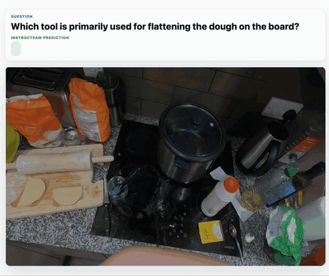
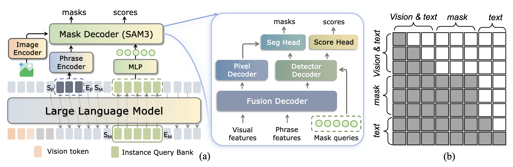

<div align="center">

# InstructSAM: Segment Any Instance with Any Instructions

[](https://arxiv.org/abs/2605.26102)
[](https://huggingface.co/CircleRadon/InstructSAM-2B)
[](https://huggingface.co/datasets/CircleRadon/Inst2Seg)
[](https://huggingface.co/datasets/CircleRadon/Inst2Seg-Bench)
[](https://youtu.be/26-yJqE8wBQ)

</div>

<table>
  <tr>
    <td></td>
    <td></td>
    <td></td>
  </tr>
  <tr>
    <td></td>
    <td></td>
    <td></td>
  </tr>
</table>


## Overview

InstructSAM is an instruction-driven multi-instance segmentation framework designed to segment arbitrary target instances from natural-language instructions.



Key features:

- **Flexible instructions**: supports category prompts, referring expressions, and reasoning-style instructions.
- **Instance-aware outputs**: predicts a set of instance masks instead of a single semantic region.
- **Efficient inference**: avoids multi-round agentic prompting and repeated SAM calls.
- **Inst2Seg dataset support**: includes training and evaluation scripts for instruction-based instance segmentation.

## News

* **[2026.5.26]** 🔥 We release InstructSAM.

## Setup

Create a conda environment with Python 3.10:

```bash
conda create -n instructsam python=3.10 -y
conda activate instructsam
pip install -r requirements.txt
pip install flash-attn --no-build-isolation
```

## Training
### Download data
We provide the training annotation JSON files on [Hugging Face](https://huggingface.co/datasets/CircleRadon/instructsam_training_eval_data). Download all JSON files and place them under `data/training`.

Raw images should be downloaded from the official source of each dataset.

### Stage 1

Stage 1 starts from the base [Qwen3-VL](https://huggingface.co/Qwen/Qwen3-VL-2B-Instruct) checkpoint:

```bash
bash scripts/train/stage1.sh
```

### Merge Stage 1 Checkpoint

After Stage 1 finishes, merge the Stage 1 LoRA weights into the base checkpoint:

```bash
python3 -m instructsam.merge_ckpt \
  --base_dir ./work_dirs \
  --model_path instructsam_stage1_2b \
  --save_path instructsam_stage1_merged
```


### Stage 2: Reasoning Fine-tuning

Stage 2 starts from the merged Stage 1 checkpoint:

```bash
bash scripts/train/stage2.sh
```

## Inference

### Download data
We provide the evaluation annotation JSON files on [Hugging Face](). Download all JSON files and place them under `data/eval`.

Run single-image inference:

```bash
python3 -m instructsam.infer \
  --model_path work_dirs/stage2 \
  --image-path path/to/image.jpg \
  --query "Please segment the object in the image." \
  --output-dir vis
```

The script prints the generated text and mask scores, then writes mask overlays to `vis/`.


## Evaluation

Available evaluation entry points:

```bash
bash evaluation/scripts/eval_inst2seg.sh
bash evaluation/scripts/eval_reasonseg.sh
bash evaluation/scripts/eval_grefcoco_ap.sh
bash evaluation/scripts/eval_roborefit.sh
```

Edit the dataset roots in each script before running. The Python evaluation files require explicit `--image_folder` and `--question_file` arguments instead of relying on machine-specific defaults.


## Citation

If you find this project useful, please cite using this BibTeX:

```bibtex
@article{yuan2026instructsam,
  title     = {InstructSAM: Segment Any Instance with Any Instructions},
  author    = {Yuqian Yuan, Wentong Li, Zhaocheng Li Yutong Lin, Juncheng Li, Siliang Tang, Jun Xiao, Yueting Zhuang, Wenqiao Zhang},
  year      = {2026},
  journal   = {arXiv},
}
```
